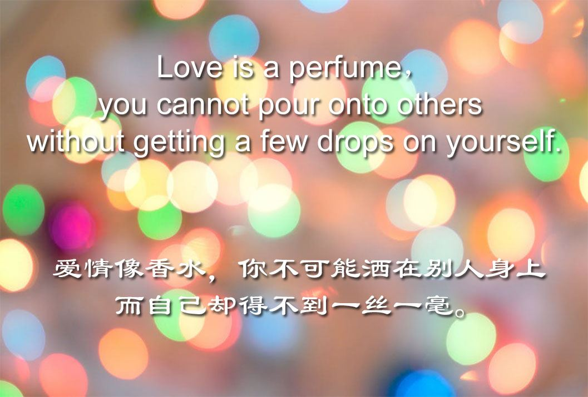
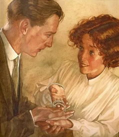

麦琪的礼物[中英对照]

# The Gift of the Magi （O·Henry）

<iframe frameborder="no" border="0" marginwidth="0" marginheight="0" width=430 height=86 src="http://k6.kekenet.com/Sound/2018/06/voa180604.mp3"></iframe>

One dollar and eighty-seven cents. That was all. And sixty cents of it was in pennies.Pennies saved one and two at a time 【by bulldozing the grocer and the vegetable man and the butcher【until one's cheeks burned with  the silent imputation of parsimony that such close dealing implied】】. Three times Della counted it. One dollar and eighty- seven cents. And the next day would be Christmas.

一元八角七。全都在这儿了，其中六角是一分一分的铜板。这些分分钱是杂货店老板、菜贩子和肉店老板那儿软硬兼施地一分两分地扣下来，直弄得自己羞愧难当，因流露出无声的责难。德拉反复数了三次，还是一元八角七，而第二天就是圣诞节了。

There was clearly nothing to do but flop down on the shabby little couch and howl. So Della did it. Which instigates the moral reflection that ==life is made up of sobs, sniffles, and smiles, with sniffles predominating==。

While the mistress of the home is gradually subsiding from the first stage to the second, take a look at the home. A furnished flat at 8 per week. It did not exactly beggar description, but it certainly had that word on the lookout for the mendicancy squad.

除了扑倒在那破旧的小睡椅上哭嚎之外，显然别无他途。德拉这样作了，可精神上的感慨油然而生，生活就是哭泣、抽噎和微笑，尤以抽噎占统治地位。

当这位家庭主妇逐渐平静下来之际，让我们看看这个家吧。一套带家具的公寓房子，每周房租八美元。尽管难以用笔墨形容，可它真真够得上乞丐帮这个词儿。  

​    【In the vestibule below 】wasa letter-box （into which no letter would go）, and an electric button （from which no mortal finger could coax a ring）. Also appertaining thereunto was a card bearing the name "Mr. James Dillingham Young."

​    The "Dillingham" had been flung to the breeze during a former period of prosperity when its possessor was being paid 30 per week. Now, when the income was shrunk to 20, though, they were thinking seriously of contracting to a modest and unassuming D. But whenever Mr. James Dillingham Young came home and reached his flat above he was called "Jim" and greatly hugged by Mrs. James Dillingham Young, already introduced to you as Della. Which is all very good."

楼下的门道里有个信箱，可从来没有装过信，还有一个电钮，也从没有人的手指按响过电铃。而且，那儿还有一张名片，上写着"詹姆斯·迪林厄姆·杨先生"。

迪林厄姆"这个名号是主人先前春风得意之际，一时兴起加上去的，那时候他每星期挣三十美元。现在，他的收入缩减到二十美元，"迪林厄姆"的字母也显得模糊不清，似乎它们正严肃地思忖着是否缩写成谦逊而又讲求实际的字母D。不过，每当詹姆斯·迪林厄姆·杨回家，走进楼上的房间时，詹姆斯·迪林厄姆·杨太太，就是刚介绍给诸位的德拉，总是把他称作"吉姆"，而且热烈地拥抱他。那当然是再好不过的了。

Della finished her cry and attended to her cheeks with the powder rag. She stood by the window and looked out dully at a gray cat walking a gray fence in a gray backyard. Tomorrow would be Christmas Day, and she had only 1.87 with which to buy Jim a present. She had been saving every penny she could for months, with this result. Twenty dollars a week doesn't go far. Expenses had been greater than she had calculated. They always are. Only 1.87 to buy a present for Jim. Her Jim. Many a happy hour she had spent planning for something nice for him.Something fine and rare and sterling--something just a little bit near to being worthy of the honor of being owned by Jim.

德拉哭完之后，往面颊上抹了抹粉，她站在窗前，痴痴地瞅着灰蒙蒙的后院里一只灰白色的猫正行走在灰白色的篱笆上。明天就是圣诞节，她只有一元八角七给吉姆买一份礼物。她花去好几个月的时间，用了最大的努力一分一分地攒积下来，才得了这样一个结果。一周二十美元实在经不起花，支出大于预算，总是如此。只有一元八角七给吉姆买礼物，她的吉姆啊。她花费了许多幸福的时日筹划着要送他一件可心的礼物，一件精致、珍奇、贵重的礼物——至少应有点儿配得上吉姆所有的东西才成啊。

There was a pier-glass between the windows of the room. Perhaps you have seen a pierglass in an $8 flat. A very thin and very agile person may, by observing his reflection in a rapid sequence of longitudinal strips, obtain a fairly accurate conception of his looks. Della, being slender, had mastered the art.

Suddenly she whirled from the window and stood before the glass. her eyes were shining brilliantly, but her face had lost its color within twenty seconds. Rapidly she pulled down her hair and let it fall to its full length.

房间的两扇窗子之间有一面壁镜。也许你见过每周房租八美元的公寓壁镜吧。一个非常瘦小而灵巧的人，从观察自己在一连串的纵条影象中，可能会对自己的容貌得到一个大致精确的概念。德拉身材苗条，已精通了这门子艺术。

突然，她从窗口旋风般地转过身来，站在壁镜前面。她两眼晶莹透亮，但二十秒钟之内她的面色失去了光彩。她急速地折散头发，使之完全泼散开来。

Now, there were two possessions of the James Dillingham Youngs in which they both took a mighty pride. One was Jim's gold watch that had been his father's and his grandfather's. The other was Della's hair. 【Had the queen of Sheba lived in the flat across the airshaft】, Della would have let her hair hang out the window some day to dry just to depreciate Her Majesty's jewels and gifts. 【Had King Solomon been the janitor, with all his treasures piled up in the basement】, Jim would have pulled out his watch every time he passed, just to see him pluck at his beard from envy.

现在，詹姆斯·迪林厄姆·杨夫妇俩各有一件特别引以自豪的东西。一件是吉姆的金表，是他祖父传给父亲，父亲又传给他的传家宝；另一件则是德拉的秀发。如果示巴女王①也住在天井对面的公寓里，总有一天德拉会把头发披散下来，露出窗外晾干，使那女王的珍珠宝贝黔然失色；如果地下室堆满金银财宝、所罗门王又是守门人的话，每当吉姆路过那儿，准会摸出金表，好让那所罗门王忌妒得吹胡子瞪眼睛。①示巴女王（QueeenofSheba）：基督教《圣经》中朝觐所罗门王，以测其智慧的示巴女王，她以美貌著称。（虚拟语气的倒装，if the queen of Sheba had lived in the flat across the airshaft）

So now Della's beautiful hair fell about her rippling and shining like a cascade of brown waters. It reached below her knee and made itself almost a garment for her. And then she did it up again nervously and quickly. Once she faltered for a minute and stood still while a tear or two splashed on the worn red carpet.

此时此刻，德拉的秀发泼撒在她的周围，微波起伏，闪耀光芒，有如那褐色的瀑布。她的美发长及膝下，仿佛是她的一件长袍。接着，她又神经质地赶紧把头发梳好。踌躇了一分钟，一动不动地立在那儿，破旧的红地毯上溅落了一、两滴眼泪。

On went her old brown jacket; on went her old brown hat. With a whirl of skirts and with the brilliant sparkle still in her eyes, she fluttered out the door and down the stairs to the street.

Where she stopped the sign read: "Mne. Sofronie. Hair Goods of All Kinds." One flight up Della ran, and collected herself, panting. Madame, large, too white, chilly, hardly looked the "Sofronie."

"Will you buy my hair?" asked Della."

"I buy hair," said Madame. "Take yer hat off and let's have a sight at the looks of it."

"Down rippled the brown cascade.

"Twenty dollars," said Madame, lifting the mass with a practised hand.

"Give it to me quick," said Della.

她穿上那件褐色的旧外衣，戴上褐色的旧帽子，眼睛里残留着晶莹的泪花，裙子一摆，便飘出房门，下楼来到街上。

她走到一块招牌前停下来，上写着："索弗罗妮夫人——专营各式头发"。德拉奔上楼梯，气喘吁吁地定了定神。那位夫人身躯肥大，过于苍白，冷若冰霜，同"索弗罗妮"的雅号简直牛头不对马嘴。

你要买我的头发吗？"德拉问。

"我买头发，"夫人说。"揭掉帽子，让我看看发样。

那褐色的瀑布泼撒了下来。

"二十美元，"夫人一边说，一边内行似地抓起头发。

"快给我钱，"德拉说。

Oh, and the next two hours tripped by on rosy wings. Forget the hashed metaphor. She was ransacking the stores for Jim's present.

She found it at last. It surely had been made for Jim and no one else. There was no other like it in any of the stores, and she had turned all of them inside out. It was a platinum fob chain simple and chaste in design, properly proclaiming its value by substance alone and not by meretricious ornamentation--as all good things should do. It was even worthy of The Watch. As soon as she saw it she knew that it must be Jim's. It was like him. Quietness and value--the description applied to both. Twenty-one dollars they took from her for it, and she hurried home with the 87 cents. With that chain on his watch Jim might be properly anxious about the time in any company. 【Grand as the watch was】, he sometimes looked at it on the sly 【on account of the old leather strap （that he used in place of a chain）】.

呵，接着而至的两个小时犹如长了翅膀，愉快地飞掠而过。请不用理会这胡诌的比喻。她正在彻底搜寻各家店铺，为吉姆买礼物。

她终于找到了，那准是专为吉姆特制的，决非为别人。她找遍了各家商店，哪儿也没有这样的东西。一条的白金表链，设计简单朴素，材质本身恰到好处地显出它的价值，而没有华丽庸俗的装饰——真正的好物就该这样。而且它正配得上那只金表。她一见这条表链，就知道一定属于吉姆所有。它就像吉姆本人，文静而有价值——这一形容对两者都恰如其份。她花去二十一美元买下了，匆匆赶回家，只剩下八角七分钱。金表匹配这条链子，无论在任何场合，吉姆都可以毫无愧色地看时间了。尽管这只表华丽珍贵，由于用的是旧皮带取代表链，他有时只偷偷地瞥上一眼。

When Della reached home her intoxicationgave way a little to prudence and reason. She got out her curling irons and lighted the gas and went to work repairing the ravages made by generosity added to love. Which is always a tremendous task, dear friends--a mammoth task.

Within forty minutes her head was covered with tiny, close-lying curls that made her look wonderfully like a truant schoolboy. She looked at her reflection in the mirror long, carefully, and critically.

"If Jim doesn't kill me," she said to herself, "before he takes a second look at me, he'll say I look like a Coney Island chorus girl. But what could I do--oh! what could I do with a dollar and eighty- seven cents?"

德拉回家之后，她的狂喜有点儿变得审慎和理智了。她找出烫发铁钳，点燃煤气，着手修补因爱情加慷慨所造成的破坏，这永远是件极其艰巨的任务，亲爱的朋友们——简直是件巨大的任务呵。

不出四十分钟，她的头上布满了紧贴头皮的一绺绺小卷发，使她活像个逃学的小男孩。她在镜子里老盯着自己瞧，小心地、苛刻地照来照去。

"假如吉姆看我一眼不把我宰掉的话，"她自言自语，"他定会说我像个科尼岛上合唱队的卖唱姑娘。但是我能怎么办呢——唉，只有一元八角七，我能干什么呢？

"At 7 o'clock the coffee was made and the frying-pan was on the back of the stove hot and ready to cook the chops.

Jim was never late. Della doubled the fob chain in her hand and sat on the corner of the table near the door that he always entered. Then she heard his step on the stair away down on the first flight, and she turned white for just a moment. She had a habit for saying little silent prayer about the simplest everyday things, and now she whispered: "Please God, make him think I am still pretty."

"The door opened and Jim stepped in and closed it. He looked thin and very serious. Poor fellow, he was only twenty-two--and to be burdened with a family! He needed a new overcoat and he was without gloves.

七点钟，她煮好了咖啡，把煎锅置于热炉上，随时都可作肉排。

吉姆一贯准时回家。德拉将表链对叠握在手心，坐在离他一贯进门最近的桌子角上。接着，她听见下面楼梯上响起了他的脚步声，她紧张得脸色失去了一会儿血色。她习惯于为了最简单的日常事物而默默祈祷，此刻，她悄声道："求求上帝，让他觉得我还是漂亮的吧。

门开了，吉姆步入，随手关上了门。他显得瘦削而又非常严肃。可怜的人儿，他才二十二岁，就挑起了家庭重担！他需要买件新大衣，连手套也没有呀。

Jim stopped inside the door, as immovable as a setter at the scent of quail. His eyes were fixed upon Della, and there was an expression in them that she could not read, and it terrified her. It was not anger, nor surprise, nor disapproval, nor horror, nor any of the sentiments that she had been prepared for. He simply stared at her fixedly with that peculiar expression on his face.

吉姆站在屋里的门口边，纹丝不动地好像猎犬嗅到了鹌鹑的气味似的。他的两眼固定在德拉身上，其神情使她无法理解，令她毛骨悚然。既不是愤怒，也不是惊讶，又不是不满，更不是嫌恶，根本不是她所预料的任何一种神情。他仅仅是面带这种神情死死地盯着德拉。

Della wriggled off the table and went for him.

"Jim, darling," she cried, "don't look at me that way. I had my hair cut off and sold 【because I couldn't have lived through Christmas without giving you a present】. It'll grow out again--you won't mind, will you? I just had to do it. My hair grows awfully fast. Say `Merry Christmas!' Jim, and let's be happy. You don't know what a nice-- what a beautiful, nice gift I've got for you."

德拉一扭腰，从桌上跳了下来，向他走过去。

"吉姆，亲爱的，"她喊道，"别那样盯着我。我把头发剪掉卖了，因为不送你一件礼物，我无法过圣诞节。头发会再长起来——你不会介意，是吗？我非这么做不可。我的头发长得快极了。说'恭贺圣诞'吧！吉姆，让我们快快乐乐的。你肯定猜不着我给你买了一件多么好的——多么美丽精致的礼物啊！"

"You've cut off your hair?" asked Jim, laboriously, as if he had not arrived at that patent fact yet even after the hardest mental labor."

"Cut it off and sold it," said Della. "Don't you like me just as well, anyhow? I'm me without my hair, ain't I?"

你已经把头发剪掉了？"吉姆吃力地问道，似乎他绞尽脑汁也没弄明白这明摆着的事实。

"剪掉卖了，"德拉说。"不管怎么说，你不也同样喜欢我吗？没了长发，我还是我嘛，对吗？"

Jim looked about the room curiously.

"You say your hair is gone?" he said, with an air almost of idiocy.

"You needn't look for it," said Della. "It's sold, I tell you--sold and gone, too. It's Christmas Eve, boy. Be good to me, for it went for you. Maybe the hairs of my head were numbered," she went on with sudden serious sweetness, "but nobody could ever count my love for you. Shall I put the chops on, Jim?"

吉姆古怪地四下望望这房间。

"你说你的头发没有了吗？"他问道，带着一种近乎白痴的神情。

"别找啦，"德拉说。"告诉你，我已经卖了——卖掉了，没有啦。这是圣诞前夜，好人儿。好好待我，这是为了你呀。也许我的头发数得清，"突然她特别温柔地接下去，"可谁也数不清我对你的恩爱啊。我做肉排了吗，吉姆？

"Out of his trance Jim seemed quickly to wake. He enfolded his Della. For ten seconds let us regard 【with discreet scrutiny 】some inconsequential object in the other direction. Eight dollars a week or a million a year--what is the difference? A mathematician or a wit would give you the wrong answer. The magi brought valuable gifts, but that was not among them. This dark assertion will be illuminated later on.

吉姆好像从恍惚之中醒来，把德拉紧紧地搂在怀里。现在，别着急，先让我们花个十秒钟从另一角度审慎地审查一下某些无关紧要的事。房租每周八美元，或者一百万美元——那有什么差别呢？数学家或才子会给你错误的答案。麦琪②带来了宝贵的礼物，但就是缺少了那件东西。这句晦涩的话，下文将有所阐明。

Jim drew a package from his overcoat pocket and threw it upon the table.  

"Don't make any mistake, Dell," he said, "about me. I don't think there's anything in the way of a haircut or a shave or a shampoo that could make me like my girl any less. But if you'll unwrap that package you may see why you had me going a while at first."

吉姆从大衣口袋里掏出一个小包，扔在桌上。

"别对我产生误会，德尔，"他说道，"无论剪发、修面，还是洗头，我以为世上没有什么东西能减低一点点对我妻子的爱情。不过，你只消打开那包东西，就会明白刚才为什么使我楞头楞脑了。

"White fingers and nimble tore at the string and paper. And then an ecstatic scream of joy; and then, alas! a quick feminine change to hysterical tears and wails, necessitating the immediate employment of all the comforting powers of the lord of the flat.

白皙的手指灵巧地解开绳子，打开纸包。紧接着是欣喜若狂的尖叫，哎呀！突然变成了女性 歇斯底里的泪水和哭泣，急需男主人千方百计的慰藉。

For there lay The Combs--the set of combs, side and back, that Della had worshipped long in a Broadway window. Beautiful combs, pure tortoise shell, with jewelled rims--just the shade to wear in the beautiful vanished hair. They were expensive combs, she knew, and her heart had simply craved and yearned over them without the least hope of possession. And now, they were hers, but the tresses（ that should have adorned the coveted adornments ） were gone.

But she hugged them to her bosom, and at length she was able to look up with dim eyes and a smile and say: "My hair grows so fast, Jim!"

还是因为摆在桌上的梳子——全套梳子，包括两鬓用的，后面的，样样俱全。那是很久以前德拉在百老汇的一个橱窗里见过并羡慕得要死的东西。这些美妙的发梳，纯玳瑁做的，边上镶着珠宝——其色彩正好同她失去的美发相匹配。她明白，这套梳子实在太昂贵，对此，她仅仅是羡慕渴望，但从未想到过据为己有。现在，这一切居然属于她了，可惜那（ 本应该有资格佩戴这垂涎已久的装饰品的 ）美丽长发已无影无踪了。

不过，她依然把发梳搂在胸前，过了好一阵子才抬起泪水迷蒙的双眼，微笑着说："我的头发长得飞快，吉姆！

"And them Della leaped up like a little singed cat and cried, "Oh, oh!

"Jim had not yet seen his beautiful present. She held it out to him eagerly upon her open palm. The dull precious metal seemed to flash with a reflection of her bright and ardent spirit.

"Isn't it a dandy, Jim? I hunted all over town to find it. You'll have to look at the time a hundred times a day now. Give me your watch. I want to see how it looks on it."

"随后，德拉活像一只被烫伤的小猫跳了起来，叫道，"喔！喔！

吉姆还没有瞧见他的美丽的礼物哩。她急不可耐地把手掌摊开，伸到他面前，那没有知觉的贵重金属似乎闪现着她的欢快和热忱。

"漂亮吗，吉姆？我搜遍了全城才找到了它。现在，你每天可以看一百次时间了。把表给我，我要看看它配在表上的样子。

"Instead of obeying, Jim tumbled down on the couch and put his hands under the back of his head and smiled.

"Dell," said he, "let's put our Christmas presents away and keep 'em a while. They're too nice to use just at present. I sold the watch to get the money to buy your combs. And now suppose you put the chops on."

吉姆非旦不按她的吩咐行事，反而倒在睡椅上，两手枕在头下，微微发笑。

"德尔，"他说，"让我们把圣诞礼物放在一边，保存一会儿吧。它们实在太好了，目前尚不宜用。我卖掉金表，换钱为你买了发梳。现在，你作肉排吧。

"The magi, as you know, were wise men--wonderfully wise men--who brought gifts to the Babe in the manger. They invented the art of giving Christmas presents. Being wise, their gifts were no doubt wise ones, possibly bearing the privilege of exchange in case of duplication. And here I have lamely related to you the uneventful chronicle of two foolish children【 in a flat】（ who most unwisely sacrificed for each other the greatest treasures of their house）.  But【 in a last word 】【to the wise of these days】 let it be said that of all （who give gifts） these two were the wisest. O all who give and receive gifts, such as they are wisest. Everywhere they are wisest. They are the magi.

正如诸位所知，麦琪是聪明人，聪明绝顶的人，他们把礼物带来送给出生在马槽里的耶稣。他们发明送圣诞礼物这玩艺儿。由于他们是聪明人，毫无疑问，他们的礼物也是聪明的礼物，如果碰上两样东西完全一样，可能还具有交换的权利。在这儿，我已经笨拙地给你们讲述了住公寓套间的两个傻孩子不足为奇的平淡故事，他们极不明智地为了对方而牺牲了他们家最最宝贵的东西。不过，让我们对现今的聪明人说最后一句话，在一切馈赠礼品的人当中，那两个人是最聪明的。在一切馈赠又接收礼品的人当中，像他们两个这样的人也是最聪明的。无论在任何地方，他们都是最聪明的人。他们就是麦琪。

<iframe src="//player.bilibili.com/player.html?aid=10913999&cid=18068304&page=1" scrolling="no" border="0" frameborder="no" framespacing="0" allowfullscreen="true"> </iframe>

